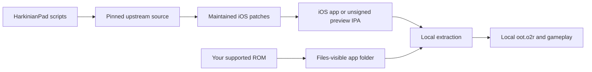

# HarkinianPad

<p align="center">
  <strong>Ocarina of Time via Ship of Harkinian, rebuilt for iPhone and iPad.</strong><br>
  Native Metal rendering, touch controls, Files-based setup, and support for
  keyboards, pointing devices, and iOS game controllers.
</p>

<p align="center">
  <a href="https://github.com/chrissotraidis/harkinianpad/actions/workflows/ios-build.yml"></a>
  
  
  
  <a href="https://github.com/chrissotraidis/harkinianpad/releases/tag/v0.1.0-preview.2"></a>
  
</p>


HarkinianPad packages the full
[Ship of Harkinian](https://github.com/HarbourMasters/Shipwright) source port
as a native iOS/iPadOS app. It renders through Metal, imports a user-provided
supported Ocarina of Time ROM through Files, and includes a landscape touch
controller that can be hidden whenever a physical controller is connected.

This repository contains the mobile integration and reproducible build
scripts. It does **not** contain Ocarina of Time, a ROM, or a playable
ROM-derived archive. See the scoped
[`rights and licensing boundary`](RIGHTS_AND_LICENSES.md); it does not
relicense Shipwright, third-party projects, or game material.

## Install status

| Option | Status | What to do |
|---|---|---|
| Developer-preview `.ipa` | **Available now** | [Download preview 0.1.0 build 2](https://github.com/chrissotraidis/harkinianpad/releases/download/v0.1.0-preview.2/HarkinianPad-0.1.0-preview.2-unsigned.ipa), then re-sign it with your Apple ID by following the [AltStore Classic guide](docs/INSTALL_IPA.md). |
| Local iPad build | **Available now** | Build and sign with your Apple development team using the instructions below. |
| Simulator | **Available now** | Best for development and UI testing; it is not a substitute for physical-device testing. |
| App Store / TestFlight | **Not announced** | No listing or public TestFlight currently exists. |

The current development build has been signed, installed, and played on a
12.9-inch iPad Pro (6th generation) running iPadOS 26.5.2. Files import,
on-device archive loading, touch gameplay, save loading, the settings menu,
and in-place app updates have all been exercised on that hardware.

Audio has been heard during repeated physical-iPad playtests. Headphone,
Bluetooth, and interruption recovery still need a complete device matrix. The
iOS controller path is present, but physical controller reconnect, rumble, and
motion testing is also incomplete.

## Get started

You need:

- a Mac with Xcode and its command-line tools;
- [Homebrew](https://brew.sh);
- an Apple ID configured in Xcode for physical-device signing; and
- your own legally acquired, supported Ocarina of Time ROM.

Install the build dependencies:

```sh
brew install cmake ninja pkgconf sdl2 glew nlohmann-json libpng libzip \
  tinyxml2 libogg libvorbis opus opusfile sdl2_net
```

Clone and build:

```sh
git clone https://github.com/chrissotraidis/harkinianpad.git
cd harkinianpad

# Simulator
scripts/build-ios.sh --simulator

# Physical iPhone or iPad
DEVELOPMENT_TEAM=ABCDE12345 \
BUNDLE_ID=com.yourname.harkinianpad \
scripts/build-ios.sh --device
```

Replace `ABCDE12345` with the 10-character team identifier shown in Xcode and
use a bundle identifier that belongs to you. The device app is written to:

```text
build-ios-soh/soh/Release-iphoneos/HarkinianPad.app
```

If Xcode needs to register the device or create a provisioning profile, open
`build-ios-soh/Ship.xcodeproj`, select the `soh` target and your device, then
choose your team under **Signing & Capabilities**.

See [`docs/BUILDING.md`](docs/BUILDING.md) for the complete Simulator,
signing, installation, controller, and package-audit workflow.
[`docs/INSTALL_IPA.md`](docs/INSTALL_IPA.md) is the short AltStore Classic
installation guide for the downloadable developer preview.

Before publishing or sharing a build, follow the
[`release checklist`](docs/RELEASE_CHECKLIST.md).

## First launch

HarkinianPad never downloads or bundles game data.

1. Launch HarkinianPad once so iOS creates its Files-visible folder.
2. Open **Files → On My iPad → HarkinianPad**.
3. Move your supported Ocarina of Time ROM into that folder.
4. Return to HarkinianPad and select **Rescan**.
5. Leave the app open while it creates the local `oot.o2r` archive.
6. Press the on-screen Start button or Start on a connected controller.

The original ROM and generated archive stay inside the app container. They
are ignored by Git and rejected by the repository's package audit.

## Touch controls

The controller is arranged for a landscape iPad held at both edges:

- **Left:** L and Z, a compact D-pad, and the control stick.
- **Right:** Start and R, the A/B/Z face cluster, and the C-button diamond.
- **Menu:** the small `•••` button remains available even when gameplay touch
  controls are disabled.
- **Toggle:** use **Settings → Controls → Touch Controls** to hide or restore
  the gameplay overlay.
- **Safety:** Reset requires confirmation instead of restarting immediately.

Opening the menu hides the gameplay controls so the settings interface remains
usable. Closing it restores the controls only when Touch Controls is enabled.

| Touch control | Shipwright binding |
|---|---|
| Control stick | W/A/S/D, including diagonals |
| D-pad | T/G/F/H |
| A / B | X / C |
| L / Z / R | E / Z / R |
| Start | Space or Return |
| C buttons | Arrow keys |
| Menu | Escape |

The touch stick is currently an eight-way control. A physical controller
remains the preferred option for full analog precision.

## Current screenshots

<table>
  <tr>
    <td width="50%">
      
    </td>
    <td width="50%">
      
    </td>
  </tr>
  <tr>
    <td align="center"><strong>Ready to play</strong><br>Every N64 input is available without a separate controller.</td>
    <td align="center"><strong>Adjust while running</strong><br>Touch controls can be toggled from Settings → Controls.</td>
  </tr>
</table>

The hero image is from the physical iPad build. The two interface captures are
from the current iPad Simulator build. All game data used for these captures
was supplied locally and is not part of this repository.

## What works

| Area | Current result |
|---|---|
| Native app | Complete Shipwright app builds for arm64 iOS/iPadOS 14+ |
| Rendering | Metal rendering works in Simulator and on physical iPad |
| Game setup | Files-visible ROM import and local `oot.o2r` loading work |
| Touch | Stick, D-pad, A/B/Z, C buttons, shoulders, Start, and persistent menu access |
| Saves | File creation/loading and in-place app updates preserving Documents data work |
| Input options | Touch, keyboard, mouse/trackpad, and SDL's iOS controller path are included |
| Packaging | ROM/game-data exclusions and signed-package checks are built into the scripts |

For detailed engineering evidence and remaining hardware checks, see
[`docs/remaining-work.md`](docs/remaining-work.md).

## Supported game

| Game | Engine | Status |
|---|---|---|
| **The Legend of Zelda: Ocarina of Time** | [Ship of Harkinian](https://github.com/HarbourMasters/Shipwright) | Supported |
| **The Legend of Zelda: Majora's Mask** | [2 Ship 2 Harkinian](https://github.com/HarbourMasters/2ship2harkinian) | Not supported by this app; it requires a separate port |

HarkinianPad is a native source-port integration, not a general Nintendo 64
emulator. A Majora's Mask ROM cannot be substituted for Ocarina of Time data.

## Reproducible and ROM-free



The compile never reads your ROM. `scripts/build-ios.sh` fetches exact upstream
revisions, disables their push URLs, applies the maintained patches, generates
Shipwright's ROM-free `soh.o2r`, and builds the app. Your ROM is introduced
only after installation.

To create the unsigned, re-signable developer-preview package, run:

```sh
scripts/package-ios.sh
```

The default preview identity is HarkinianPad `0.1.0`, build `2`, with bundle
identifier `com.chrissotraidis.harkinianpad`. The package is named
`HarkinianPad-0.1.0-preview.2-unsigned.ipa`. It contains no maintainer
certificate or provisioning profile; a sideload tool such as AltStore Classic
must re-sign it for the installer's device.

[Download developer preview 0.1.0 build 2](https://github.com/chrissotraidis/harkinianpad/releases/download/v0.1.0-preview.2/HarkinianPad-0.1.0-preview.2-unsigned.ipa).
The release page records the exact SHA-256 for the published asset.

The audit rejects Simulator products, stale signing material, original ROMs,
ROM-derived `oot*.o2r`/`.otr` files, and prohibited game data. For a local
maintainer-signed package, use `REQUIRE_SIGNED=1 scripts/package-ios.sh`.

## Frequently asked questions

<details>
<summary><strong>Where is the IPA?</strong></summary>

[Download the unsigned developer-preview IPA from GitHub Releases](https://github.com/chrissotraidis/harkinianpad/releases/tag/v0.1.0-preview.2).
It is not an App Store or TestFlight build; follow the
[AltStore Classic guide](docs/INSTALL_IPA.md) to sign it with your own Apple ID.
</details>

<details>
<summary><strong>Does this repository include Ocarina of Time?</strong></summary>

No. You must provide your own legally acquired supported ROM. Do not open
issues requesting game data or download links.
</details>

<details>
<summary><strong>Does audio work?</strong></summary>

Yes. Audio has been heard during repeated physical-iPad gameplay sessions.
Speaker playback is accepted for the developer preview; headphone, Bluetooth,
and interruption recovery remain additional hardware checks.
</details>

<details>
<summary><strong>Can I hide touch controls and get them back later?</strong></summary>

Yes. The persistent `•••` button keeps the menu reachable. Open
**Settings → Controls** and toggle **Touch Controls**.
</details>

<details>
<summary><strong>Does it support controllers?</strong></summary>

The existing Shipwright SDL controller mappings are compiled into the app for
iOS-compatible controllers. Physical gameplay, reconnect, rumble, and motion
support still require model-specific verification.
</details>

<details>
<summary><strong>Is this an App Store or TestFlight release?</strong></summary>

No. The downloadable build is an unsigned developer-preview IPA for personal
re-signing. App Store, TestFlight, AltStore PAL, and SideStore distribution are
separate projects with different signing, review, account, and regional
requirements.
</details>

<details>
<summary><strong>What is the licensing status?</strong></summary>

Each upstream component retains its own license and copyright. Libultraship,
ZAPDTR, OTRExporter, SDL, and their dependencies carry their respective
licenses. The pinned Shipwright tree and this repository currently have no
single top-level project license, so do not describe the project as broadly
redistributable open source without resolving that boundary.
</details>

## Experimental tvOS port

A compile-first Apple TV target is now available as an early engineering
preview. It is controller-first and intentionally does not yet claim a solved
game-data import flow. See [`docs/TVOS.md`](docs/TVOS.md) for build commands,
current limitations, and the physical-device acceptance sequence.

## Project map

| Path | Purpose |
|---|---|
| [`scripts/build-ios.sh`](scripts/build-ios.sh) | Complete Simulator or device build |
| [`scripts/package-ios.sh`](scripts/package-ios.sh) | Unsigned/signed IPA and game-data audit |
| [`scripts/check-repo-safety.sh`](scripts/check-repo-safety.sh) | Fast tracked-asset, history, patch, script, and documentation gate |
| [`patches/`](patches/) | HarkinianPad changes replayed onto pinned upstream source |
| [`docs/BUILDING.md`](docs/BUILDING.md) | Full build, signing, installation, and testing guide |
| [`docs/INSTALL_IPA.md`](docs/INSTALL_IPA.md) | Developer-preview IPA installation with AltStore Classic |
| [`docs/RELEASE_CHECKLIST.md`](docs/RELEASE_CHECKLIST.md) | Source and IPA publication gates |
| [`docs/touch-controls-design.md`](docs/touch-controls-design.md) | Touch layout and input contract |
| [`docs/remaining-work.md`](docs/remaining-work.md) | Evidence ledger and remaining gates |
| [`ref/`](ref/) | Ignored local reference area; only its safety README is tracked |

Generated source trees, build directories, artifacts, ROMs, and ROM-derived
archives are ignored and must never be committed.

## Contributing and support

Use the structured
[bug report](https://github.com/chrissotraidis/harkinianpad/issues/new/choose)
for reproducible gameplay or platform defects. Read
[`CONTRIBUTING.md`](CONTRIBUTING.md) before proposing a change and
[`SECURITY.md`](SECURITY.md) before reporting a sensitive vulnerability.
Never attach or request game data.

## Legal and acknowledgements

HarkinianPad is an unofficial community project and is not affiliated with or
endorsed by Nintendo or Harbour Masters. It does not provide the game, ROM
downloads, or playable ROM-derived data.

This project builds on Ship of Harkinian, libultraship, ZAPDTR, OTRExporter,
the Ocarina of Time decompilation project, SDL, and their contributors. All
projects, copyrights, and trademarks belong to their respective owners.
